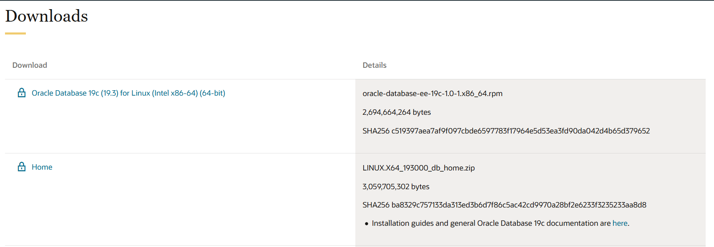
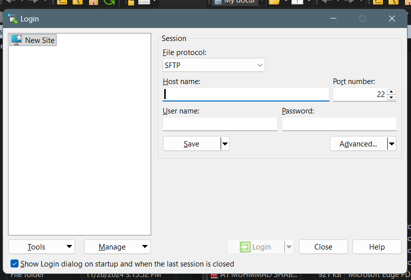
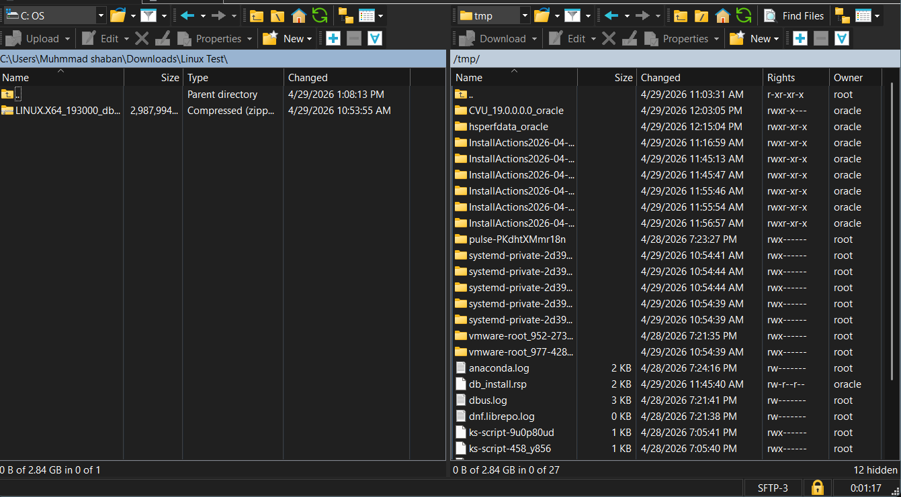
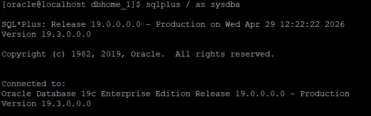

# 🚀 Oracle 19c Silent Installation on Oracle Linux 8

## 📌 Overview

This project demonstrates a **complete silent installation of Oracle Database 19c** on Oracle Linux 8, including:

* Software installation (no GUI)
* Database creation using DBCA
* Troubleshooting common errors

  This approach reflects real-world production environments where GUI access is not available.
---

## 🧱 Environment

* OS: Oracle Linux 8.x
* Oracle DB: 19c (19.3)
* Tooling: PuTTY, WinSCP

---

## 📥 Step 1: Download Oracle 19c




Download from Oracle official site:

* `LINUX.X64_193000_db_home.zip`

---

## 📤 Step 2: Transfer File to Server (WinSCP)



Connect to your server using WinSCP with hostname, username, and password. Upload the Oracle installation zip file to /tmp on the target server.

Upload the zip file to:



/tmp/


---

## ⚙️ Step 3: OS Preparation (run as root)

```bash
dnf install -y oracle-database-preinstall-19c unzip

mkdir -p /u01/app/oracle/product/19.3.0/dbhome_1
mkdir -p /u01/app/oraInventory

chown -R oracle:oinstall /u01
chmod -R 775 /u01
```

---

## 📦 Step 4: Extract Oracle Software

```bash
export ORACLE_BASE=/u01/app/oracle
export ORACLE_HOME=/u01/app/oracle/product/19.3.0/dbhome_1
export PATH=$ORACLE_HOME/bin:$PATH
cd $ORACLE_HOME
unzip /tmp/LINUX.X64_193000_db_home.zip
```

---

## 📝 Step 5: Configure Response File

```bash
vi $ORACLE_HOME/install/response/db_install.rsp
```

Update:

```ini
oracle.install.option=INSTALL_DB_SWONLY

UNIX_GROUP_NAME=oinstall
INVENTORY_LOCATION=/u01/app/oraInventory

ORACLE_HOME=/u01/app/oracle/product/19.3.0/dbhome_1
ORACLE_BASE=/u01/app/oracle

oracle.install.db.InstallEdition=EE

oracle.install.db.OSDBA_GROUP=oinstall
oracle.install.db.OSOPER_GROUP=oinstall
oracle.install.db.OSBACKUPDBA_GROUP=oinstall
oracle.install.db.OSDGDBA_GROUP=oinstall
oracle.install.db.OSKMDBA_GROUP=oinstall
oracle.install.db.OSRACDBA_GROUP=oinstall

oracle.install.db.rootconfig.executeRootScript=false
```

---

## ⚠️ Step 6: Fix OS Compatibility Issue

```bash
export CV_ASSUME_DISTID=OL8
```
> ⚠️ Note: Oracle 19c installer may not recognize newer Oracle Linux 8 versions. Setting `CV_ASSUME_DISTID=OL8` ensures compatibility.
---

## 🚀 Step 7: Run Silent Installer


```bash
cd $ORACLE_HOME

./runInstaller -executePrereqs -silent \
-responseFile install/response/db_install.rsp

./runInstaller -silent \
-responseFile install/response/db_install.rsp \
-ignorePrereq
```

---

## 🔐 Step 8: Run Root Scripts

```bash
su -

/u01/app/oraInventory/orainstRoot.sh
/u01/app/oracle/product/19.3.0/dbhome_1/root.sh
```

---

## 🏗️ Step 9: Create Database (DBCA Silent)

```bash
dbca -silent -createDatabase \
-gdbname ORCL \
-sid ORCL \
-templateName General_Purpose.dbc \
-characterSet AL32UTF8 \
-memoryMgmtType auto_sga \
-totalMemory 2048 \
-storageType FS \
-datafileDestination "/u01/app/oracle/oradata" \
-redoLogFileSize 50 \
-emConfiguration NONE \
-sysPassword Oracle123 \
-systemPassword Oracle123 \
-createAsContainerDatabase true \
-numberOfPDBs 1 \
-pdbName PDB1 \
-pdbAdminPassword Oracle123
```

---

## 🔍 Step 10: Verify Database



```bash
export ORACLE_SID=ORCL
sqlplus / as sysdba
```

```sql
startup;
select name,open_mode from v$database;
show pdbs;
alter pluggable database all open;
```

---

## ⚡ Common Issues & Fixes

| Issue             | Fix                           |
| ----------------- | ----------------------------- |
| INS-08101         | `export CV_ASSUME_DISTID=OL8` |
| Missing OS groups | Add in response file          |
| DBT-10325         | Add `-templateName`           |
| ORA-01034         | Set `ORACLE_SID`              |
| Idle instance     | Environment mismatch          |

---

## 📁 Project Structure

```
oracle-19c-silent-install-ol8/
├── README.md
└── screenshots/
```

---

## 🎯 Outcome

* Oracle 19c installed (silent mode)
* Database ORCL created
* PDB1 configured
* Multitenant architecture configured (CDB: ORCL, PDB: PDB1)
* Fully CLI-driven setup

---

## 👤 Author

**Muhmmad Shaban**

- 📧 Email: mshaban0121@gmail.com  
- 💼 LinkedIn: https://www.linkedin.com/in/muhmmadshaban
- 🐙 GitHub: https://github.com/muhmmadshaban
